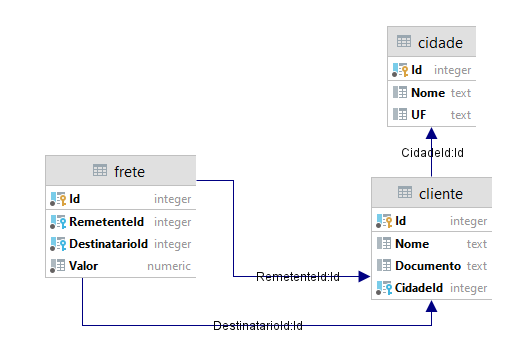

## Instruções

1. Instalar SDK .NET 5.0: <https://dotnet.microsoft.com/download/dotnet/5.0>
2. Instalar ferramentas CLI de migrations do EF Core
```bash
dotnet tool install --global dotnet-ef
```

3. Subir instância postgres para teste
```bash
docker run -d --name postgres -e POSTGRES_PASSWORD=123456 -p 5432:5432 postgres:12.2-alpine
```

4. Aplicar migrations
```bash
cd ConsoleApp
dotnet ef database update
```

5. Executar aplicação
```bash
dotnet run
```

## Migrations

Adicionar migrations

```bash
dotnet ef migrations add Inicio
```

Atualizar base de dados

```bash
dotnet ef database update
```

Remover migrations e resetar base de dados

```bash
dotnet ef database update 0
dotnet ef migrations remove
```

## DB



## Queries

### Ordenação sem paginação

C# Fluent LINQ Query

```csharp
var query = conn.Fretes
    .Where(x => x.Remetente.Cidade.UF == "SC")
    .Select(x => new
    {
        x.Id,
        x.Valor,
        NomeRemetente = x.Remetente.Nome,
        NomeDestinatario = x.Destinatario.Nome,
        CidadeRemente = x.Remetente.Cidade.Nome,
        CidadeDestinatario = x.Destinatario.Cidade.Nome
    })
    .OrderByDescending(x => x.Valor);
var fretes = query.ToList();
```

Tradução SQL

```sql
SELECT f."Id", f."Valor", c."Nome" AS "NomeRemetente", c1."Nome" AS "NomeDestinatario", c0."Nome" AS "CidadeRemente", c2."Nome" AS "CidadeDestinatario"
FROM frete AS f
         INNER JOIN cliente AS c ON f."RemetenteId" = c."Id"
         INNER JOIN cidade AS c0 ON c."CidadeId" = c0."Id"
         INNER JOIN cliente AS c1 ON f."DestinatarioId" = c1."Id"
         INNER JOIN cidade AS c2 ON c1."CidadeId" = c2."Id"
WHERE c0."UF" = 'SC'
ORDER BY f."Valor" DESC
```

### Ordenação com paginação

C# Fluent LINQ Query

```csharp
var query = conn.Fretes
    .Where(x => x.Remetente.Cidade.UF == "SC")
    .Select(x => new
    {
        x.Id,
        x.Valor,
        NomeRemetente = x.Remetente.Nome,
        NomeDestinatario = x.Destinatario.Nome,
        CidadeRemente = x.Remetente.Cidade.Nome,
        CidadeDestinatario = x.Destinatario.Cidade.Nome
    })
    .OrderByDescending(x => x.Valor)
    .Take(10)  // << Adicionado
    .Skip(30); // << Adicionado
var fretes = query.ToList();
```

Tradução SQL

O ORM primeiro aplica uma query com o filtro UF = 'SC' com os mínimos join's necessários para resolver a condição, após isto limita os resultados e aplica os demais join's para obter os demais campos.      
A query numa primeira visão parece maior que o necessário, mas está bem otimizada.  
Também vale resaltar o cache de plano de execução do DB que torna rápida a analise do comando enviado e a seleção dos indices necessários para execução (Embora o PostgreSQL não tenha tal recurso, a performance dele é ótima).

```sql
SELECT t0."Id", t0."Valor", t0."Nome" AS "NomeRemetente", c1."Nome" AS "NomeDestinatario", t0."Nome0" AS "CidadeRemente", c2."Nome" AS "CidadeDestinatario"
FROM (
         SELECT t."Id", t."DestinatarioId", t."Valor", t."Nome", t."Nome0"
         FROM (
                  SELECT f."Id", f."DestinatarioId", f."Valor", c."Nome", c0."Nome" AS "Nome0"
                  FROM frete AS f
                           INNER JOIN cliente AS c ON f."RemetenteId" = c."Id"
                           INNER JOIN cidade AS c0 ON c."CidadeId" = c0."Id"
                  WHERE c0."UF" = 'SC'
                  ORDER BY f."Valor" DESC
                      LIMIT @__p_0
              ) AS t
         ORDER BY t."Valor" DESC
         OFFSET @__p_1
     ) AS t0
         INNER JOIN cliente AS c1 ON t0."DestinatarioId" = c1."Id"
         INNER JOIN cidade AS c2 ON c1."CidadeId" = c2."Id"
ORDER BY t0."Valor" DESC
```
